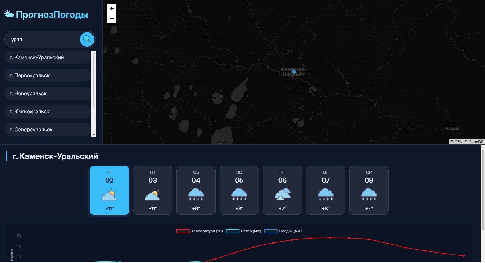
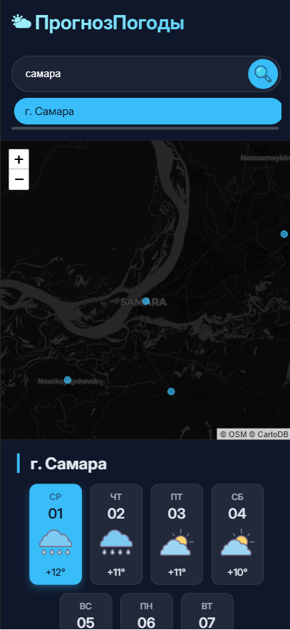

# Карта погоды — интерактивная карта погоды

Веб-приложение для просмотра прогноза погоды по населённым пунктам. На интерактивной карте отмечены города, при клике на маркер загружается прогноз на несколько дней с почасовыми графиками температуры, ветра и осадков.

## Функциональность

- Интерактивная карта с маркерами населённых пунктов (данные из `settlements.json`).
- Поиск города по названию с отображением результатов в левой панели.
- Получение прогноза погоды через **Open-Meteo API** (температура, скорость ветра, осадки).
- Почасовой график с возможностью выбора дня (карточки с иконкой погоды и средней температурой).
- Адаптивный дизайн (десктоп / мобильные устройства).

## Скриншоты

Десктопная версия



Мобильная версия




## Технологии

### Бэкенд (Python)
- **FastAPI** — веб-фреймворк для создания API
- **Uvicorn** — ASGI-сервер
- **Requests** — для запросов к внешнему API
- **CORS** — настроен для взаимодействия с клиентом

### Фронтенд (JS/HTML/CSS)
- **Leaflet** — карта и маркеры
- **Chart.js** — построение графиков
- **Google Fonts / Inter** — стилизация

## Структура проекта
```
WEBSEC-2/
├── client/                 # Фронтенд
│   ├── image/              # Иконки 
│   ├── index.html          # Главная страница
│   ├── script.js           # Логика карты, запросов, графиков
│   └── style.css           # Стили
├── data/                   # Данные и скрипты для подготовки
│   ├── all_settlements.csv # Исходный файл с населёнными пунктами
│   ├── const.py            # Константы 
│   ├── main.py             # Скрипт подготовки settlements.json
│   └── prepare_settlements.py
├── settlements.json        # Финальный JSON с координатами и названиями
├── server/                 # Бэкенд (FastAPI)
│   ├── const.py            # Константы для сервера (DATA_FILE)
│   ├── main.py             # Точка входа FastAPI, CORS, статика
│   └── router.py           # Эндпоинты /settlements, /search, /city, /weather
├── .gitignore
└── README.md
```
